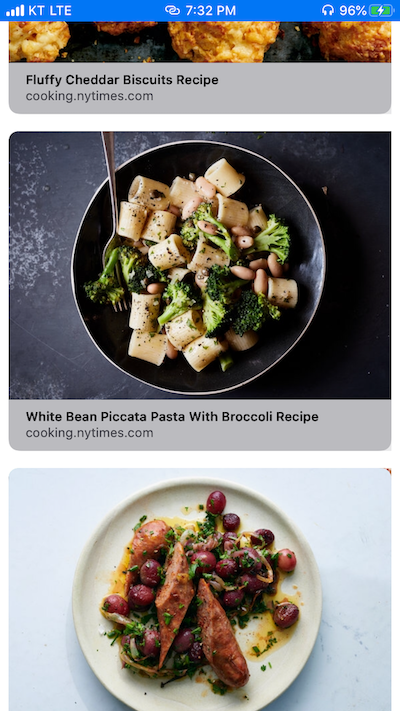

# Rich-Links

## WWDC 2019
> Embedding and Sharing Visually Rich Links
- LinkPresentation 프레임 워크를 통해 앱 개발자는 풍부하고 아름답고 일관된 방식으로 URL을 쉽게 제시 할 수 있으며, LinkPresentation을 사용하여 URL에서 메타 데이터를 검색하고 앱 내부에 풍부한 링크 컨텐츠를 제공할 수 있다.

## Retrieving metadata
> URL 메타데이터 표시

- 타이틀 Optional
- 아이콘 Optional
- 이미지 Optional
- 비디오 Optional

```
let metadataProvider = LPMetadataProvider()
let url = URL(string: "https://www.apple.com/ipad")!
    metadataProvider.startFetchingMetadata(for: url) { metadata, error in
    if error != nil {
        // The fetch failed; handle the error.
        return
    }
    
    // TODO: Make use of fetched metadata.
}
```

## Retrieving metadata flow
- LPMetadataProvider를 만든 다음 원하는 URL을 사용해 startFetchingMetadata를 호출한다.
- Completion handler가 호출되면 오류가 있는지 확인한다.
- 서버가 응답하지 않거나 속도가 느리거나 사용자가 네트워크에 연결되지 않으면 메타데이터를 가져오는것이 실패할 수 있다. 
    -  에러 발생 (30초) ``` Could not signal service com.apple.WebKit.WebContent: 113: Could not find specified service ```

## Using LinkPresentation Framework



### [WWDC 2019 - Embedding and Sharing Visually Rich Links](https://developer.apple.com/documentation/linkpresentation)
